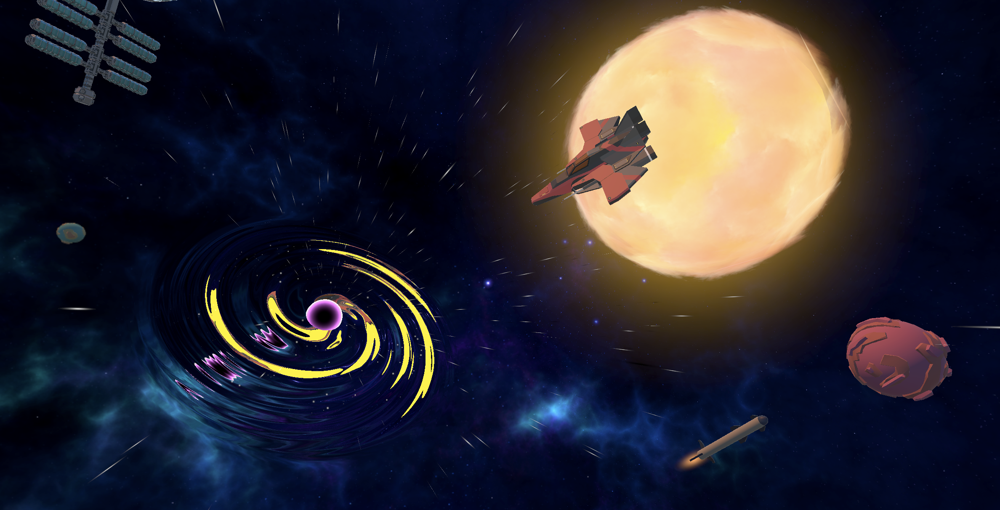

+++
project_id = "B1"
title = "CHEF"
subtitle = "Body-challenging VR experience"
claim = "Explore new ways of what VR entertainment can achieve"
abstract = "CHEF is a virtual reality game that blends physical engagement with cutting-edge VR technology to deliver an immersive experience. Designed for immediate playability, the game features captivating visuals and mechanics that hook players from the start without requiring extensive instructions."

# Properties for displaying the project in the project list
card_image = "chef_logo2.png"

# Names are optional, team size is sufficient
team = ["Maxim", "Leah", "Leonid", "Sascha", "Sergej", "Sodbilegt"]
supervisor = "Prof. Strippgen"
draft = false

website_link = ""
source_link = ""
+++


Our goal was to create a VR experience that challenges the body while leveraging the latest VR technologies in unexpected and playful ways. We set out to design a game that is both instantly engaging and easy to pick up, requiring minimal explanation to players. To achieve this, we focused on using the Meta Quest 3 and Unity Engine as our primary development tools.



Our team consists of six IMI students who are passionate about the video games industry. To collaborate and exchange our ideas we used several tools like Discord, Github and Miro Board.
Early in the development process, we decided to divide our efforts into two dedicated teams: one focused on visuals and the other on programming. Each team member took on specific responsibilities, from crafting a captivating space environment to designing and fine-tuning the mechanics of the ingredient spawner. Collaboration was at the heart of our workflow, with continuous idea exchange fostering a highly creative and supportive workspace.













