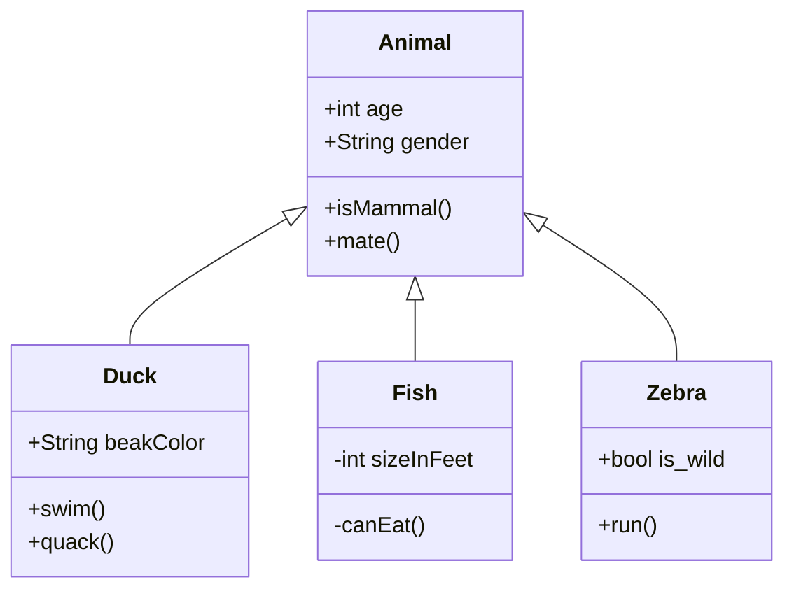

+++
title = "Tech Stack"
weight = 30
draft = true
hasMermaid = true
+++


Hugo offers a couple of options to include diagrams right in the source code, see
[https://gohugo.io/content-management/diagrams/](https://gohugo.io/content-management/diagrams/)

Here's a mermaid example: (note the hasMermaid = true parameter in the front matter!)





Lorem ipsum dolor sit amet, consectetur adipiscing elit. Nulla facilisis neque id vulputate malesuada. Quisque dignissim finibus urna sed sagittis. 



