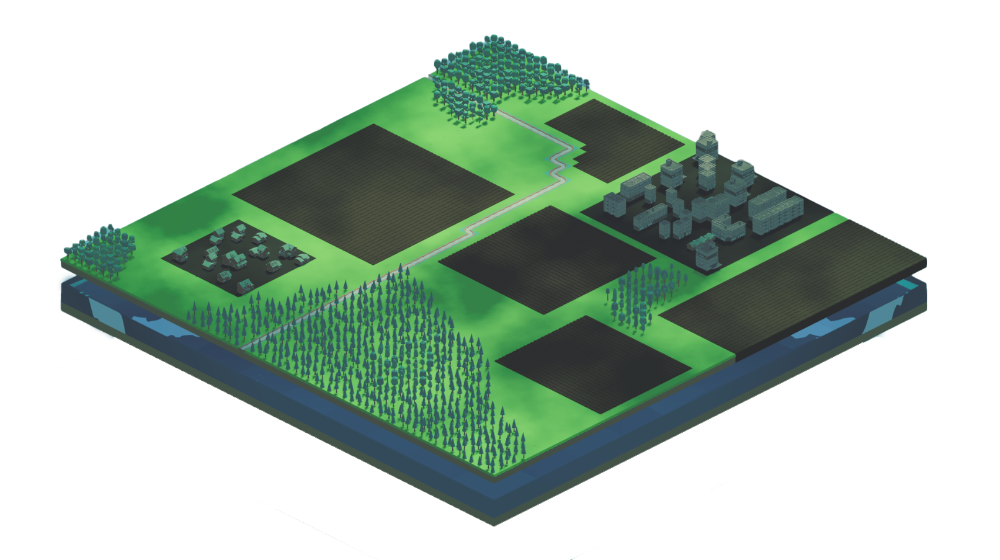

+++
project_id = "M1"
title = "Aquasolace"
subtitle = "Gaming for Future II: Turning the simulation into a game"
claim = "Aquasolace - Gaming For Future"
abstract = ""

# Properties for displaying the project in the project list
card_image = "game_logo.png"
# card_description is deprecated, will be replaced by abstract/and or claim
card_description = "Aquasolace - Gaming For Future" 

# Names are optional, team size is sufficient
team = ["Eliot Hoff", " Kenneth Englisch", "Martin Christian Solihin", "Adib Ghassani Waluya", "Sebastian Puetz"]
supervisor = "David Mueller"
draft = false

website_link = ""
source_link = ""

tags = []
categories = []
study_focus = ['Game Technology']

# imagemagick befehl
# magick team_kenneth.png -strip -interlace Plane -gaussian-blur 0.05 -quality 85% team_enneth.jpg
# magick team_adib.jpeg -strip -interlace Plane -gaussian-blur 0.05 -quality 85% team_adib.jpg
# magick team_elliot.png -strip -interlace Plane -gaussian-blur 0.05 -quality 85% team_elliot.jpg
# magick team_martin.jpg -strip -interlace Plane -gaussian-blur 0.05 -quality 85% team_martin.jpg
# magick team_sebastian.jpg -strip -interlace Plane -gaussian-blur 0.05 -quality 85% team_sebastian.jpg

# magick game_logo.png -strip -interlace Plane -quality 85% game_logo.png
# magick nabu_logo.jpg -strip -interlace Plane -quality 85% nabu_logo.jpg
# magick game_image.png -strip -interlace Plane -quality 85% game_image.png
+++


Our project aimed to transform an existing simulation ([see last term's project](/ws23/master/m4-gamingforthefuture/)) into an engaging game experience. The focus was on expanding gameplay features and integrating a layer of biodiversity. AquaSolace is a single-player strategy and environmental simulation game designed to raise awareness about the pressing issue of water scarcity. Our objective was to capture players' attention and educate them about this critical issue through immersive gameplay and interactive learning.
<figure></figure>



Our team consists of five IMI-Master students.







 



  

    <h2>Eliot</h2>
    <ul>
      <li>Game Development</li>
      <li>Music Production</li>
    </ul>
  

  

    <h2>Kenneth</h2>
    <ul>
      <li>Game Development</li>
      <li>UI/UX Design</li>
    </ul>
  

  

    <h2>Martin</h2>
    <ul>
      <li>Game Development</li>
    </ul>
  

  

    <h2>Adib</h2>
    <ul>
      <li>Game Development</li>
      <li>Music Production</li>
    </ul>
  

  

    <h2>Sebastian</h2>
    <ul>
      <li>Game Development</li>
      <li>Contact to Fiverr Artists for Animal Models</li>
      <li>Animation</li>
    </ul>
  

 



NABU (Naturschutzverband e.V) is an NGO with approximately 900,000 members (more than 1% of the population)
environmental education, spreading of public awareness, cooperations with local groups,
institutions and authorities to promote nature-friendly policies
