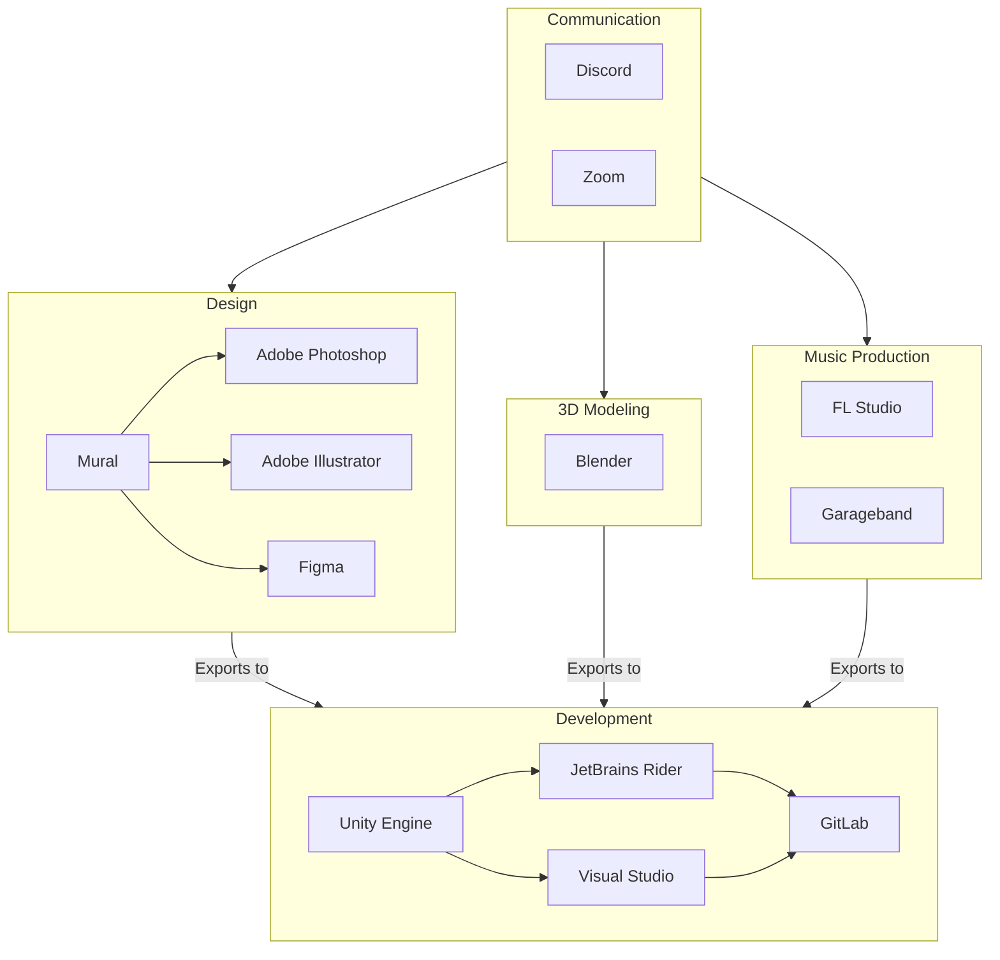

+++
title = "Tech Stack"
weight = 30
draft = false
hasMermaid = true
+++



Our project utilizes a diverse tech stack to support various aspects of development, design, 3D modeling, music production, and communication.

## Development:
We leverage Unity Engine for robust game development, integrated seamlessly with JetBrains Rider and Visual Studio for efficient coding and version control through GitLab.

## Design:
Graphic and UI design is powered by industry-standard tools including Adobe Photoshop and Adobe Illustrator, along with collaborative platforms like Figma and Mural for design iterations and team collaboration.

## 3D Modeling:
Blender serves as our primary tool for creating intricate 3D models, essential for our project's visual and interactive elements.

## Music Production:
For creating immersive soundscapes and music, we utilize FL Studio and Garageband, ensuring high-quality audio integration into our projects.

## Communication:
To facilitate seamless team communication and collaboration, we rely on platforms such as Discord for real-time messaging and Zoom for virtual meetings and presentations.

This comprehensive tech stack enables us to efficiently develop, design, and collaborate on projects, ensuring both creative excellence and technical robustness throughout the development lifecycle.




