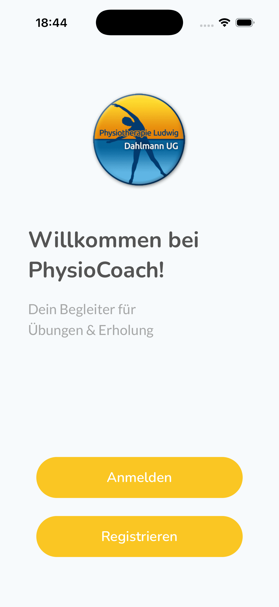
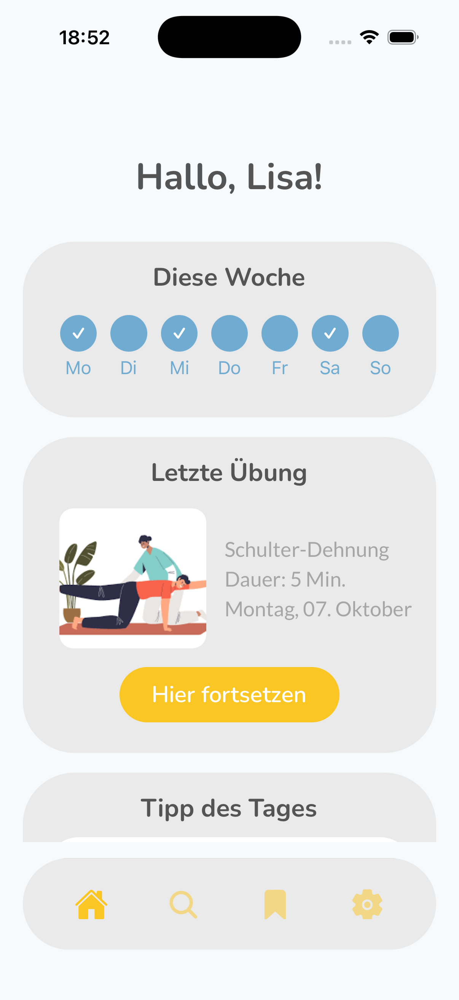
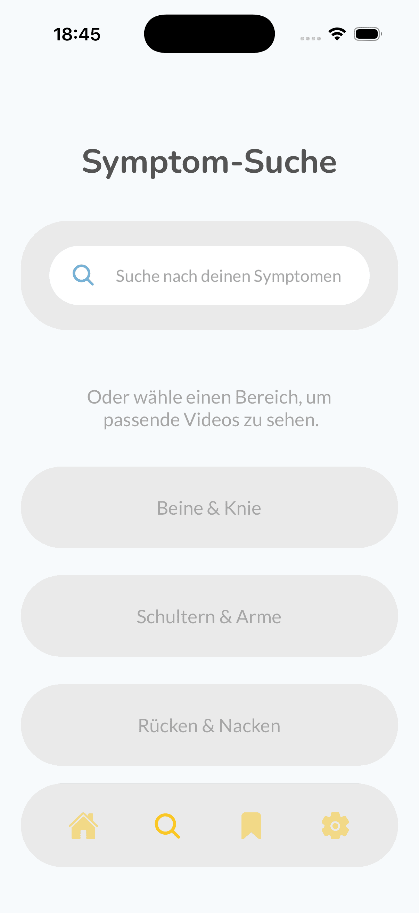

+++

# TO DO:
#   add logo, images, screenshots

project_id = "B5"
title = "PhysioCoach"

subtitle = "Physiotherapeutische Übungsbegleitung im Alltag"
claim = "Übungen zu Hause korrekt durchführen – einfach, sicher, motivierend."

# Properties for displaying the project in the project list
card_image = "logo.png"

team = ["Khoa Nguyen", "Mandy Nguyen"]
supervisor = "Julian Fiebig"
draft = false

# github
source_link = "https://github.com/MKhoa03/PhysioCoach"
+++

PhysioCoach unterstützt Patient:innen dabei, physiotherapeutische Übungen zu Hause korrekt und regelmäßig durchzuführen.
Die App bietet verständliche Anleitungen in Zusammenarbeit mit der Physiotherapiepraxis Dahlmann.


Viele Menschen bekommen nach einer physiotherapeutischen Behandlung, die meist nur einige Wochen beträgt, Trainingsübungen mit.  
Doch ohne Anleitung ist es oft schwer, diese korrekt durchzuführen oder man vergisst sie im Alltag.

**Unser Ziel:**
- einfache und sichere Übungsführung
- strukturierte Trainingsübersicht
- Motivation zur kontinuierlichen Durchführung



- Kategorisierte Übungen (z. B. Rücken & Nacken, Schultern & Arme, Beine & Knie)  
- Detailseiten mit Beschreibung, Dauer & Visualisierungen  
- Favoritenfunktion für häufig genutzte Übungen  
- Benutzerfreundliches, ruhiges UI-Design  


  
  
  


Die App wurde mit **React Native & Expo** entwickelt.  
- **Frontend:** TypeScript/TSX für die Benutzeroberfläche  
- **Backend:** JavaScript/Node.js für Server-Funktionen  
- **Navigation:** Expo Router  
- **Design:** Eigenes Theme mit responsiven Layouts für verschiedene Bildschirmgrößen  



Das Projekt befindet sich derzeit noch in der Umsetzung.
Ein Großteil der Grundfunktionen, wie die Anzeige und Strukturierung von Übungen, ist bereits entwickelt.

Aktuell liegt der Fokus auf der Verbesserung des Nutzererlebnisses sowie der Integration weiterer Funktionen, wie einer Favoritenverwaltung und einer einfachen Fortschrittsübersicht.



Unser Team besteht aus zwei Studierenden, die das Projekt als Semesterarbeit umgesetzt haben.





