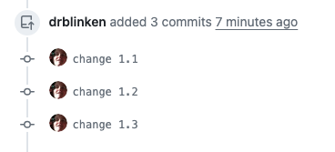

# 02. Git Forking Workflow 01
#bear/2024/07/07/created
#showtime/website/forking-workflow/02

The following is a step-for-step walkthrough of the workflow - part 01.

Atlassian Git Tutorial: [Forking Workflow](https://www.atlassian.com/git/tutorials/comparing-workflows/forking-workflow)
GitHub Docs: [Collaborating with pull requests](https://docs.github.com/en/pull-requests/collaborating-with-pull-requests)

## Used Example Repos:
https://github.com/htw-imi-showtime/example-central-repo
[drblinken/example-central-repo-fork](https://github.com/drblinken/example-central-repo-fork)

### 1. Make some local changes
(Note that I made a mistake here: I should have created a branch first, e.g. with `git checkout -b b0_pr1_create_project`)


### 2. git push
The changes are now visible on github:


### 3. create PR
https://github.com/htw-imi-showtime/example-central-repo/pull/1
the commits are listed in the PR:


### 4. make 2 fixes..
of course, the SGS requested changes. So, 2 more commits are added:

### 5. push them - they will be visible in the PR!

### 6. PR is MERGED
success! This is how the central repo looks like:
(I made the second mistake here - I did a merge instead of a squash & merge which would have replaced the 5 commits in the PR into a single clean commit. This would have been preferable because the 5 commits clutter up the history and usually are of no use for others):


Central Repo after merge

### 7. Get the PR to your local repo (clone)

The local repo still looks the same:


```
git remote add upstream git@github.com:htw-imi-showtime/example-central-repo.git
git fetch upstream main
```


Now, upstream/main is in your local repo. If you continued working on main now (commit 0f64ac3) you’d still work from your old history, withouth the PR merge commit df588e5 in your history.

### 8. PR 02: A better way

As mentioned, with PR 01 I made two mistakes:

1. not creating a branch locally
2. Merge instead of Squash & Merge in the Central Repo

With PR 2, the local changes are in their own branch `pr_02`
and the pull request was squashed into a single commit, 
(6b9ce04) (apart from possible other changes in the main repo,
they should be the same, and contain all your changes made in branch pr_02)

This is what the local repo looks like after getting the pr commit from upstream:


There will never be a merge. The branch pr_02 can be deleted, or 
kept for reference if you like to keep your detailed history.

### 9. Prepare a branch for further work

There are several ways to resolve this - see the next page.


