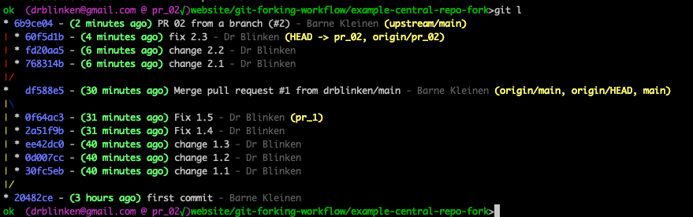
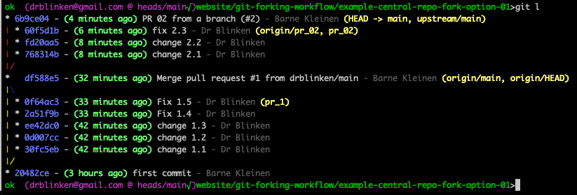
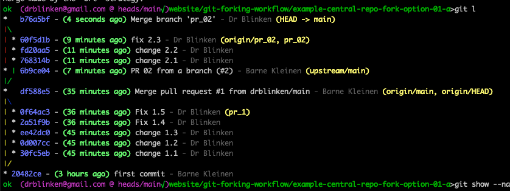
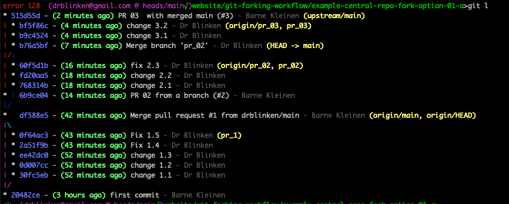
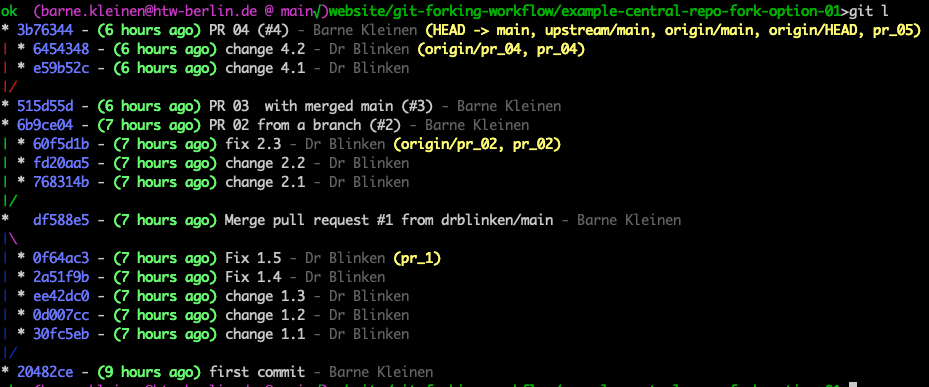

# Update your local repo after PR has been merged

#bear/2024/07/07/created
 #showtime/website/forking-workflow/03

What happened before:
- our PR, based on branch  branch pr_02 has been merged. 
- we fetched the newest version, containing our changes, with 
- `git fetch upstream main` creating or updating the branch upstream/main in our local repo, containing the PR merge commit 6b9ce04

this is how our repo looks like:

local repo

### Merge upstream/main to main
Now, we merge the upstream changes to our main branch:
```
git checkout main
git merge upstream/main
```
or simply: (pull does a fetch and merge)
```
git checkout main
git pull upstream main
```

As we haven’t changed main since the last PR, main can be fast-forwarded resulting in the clean history above (note that main and upstream/main only have three commits - the “first commit” and the two PR merges)

**NEVER changing main and keeping it up-to-date with upstream/main is the easiest way to go!**

### If we DID change main
(or force a merge commit) - then we get a merge commit. The local history is not as clean; otherwise, its not a problem.

### PR 03
and so on…

### PR 05 in preparation
and on… (note that upstream/main and thus main contains another PR 03 here, which is not from us)


This way - and with careful branch naming - you get a simple local history.
Furthermore, there should be no merge conflicts, as no merges happen.
The only source of a merge conflict may happen if you created a new branch before your PR was merged into upstream/main (or your main, for that matter).
But if it happens: the next page shows you what to do.

