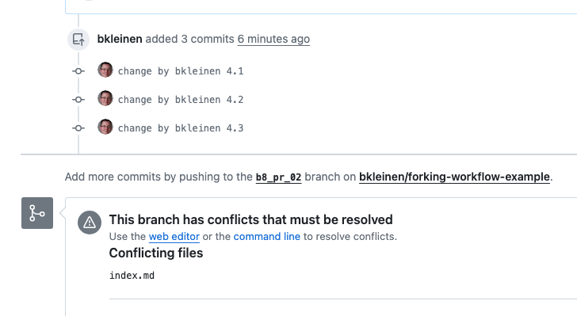

# Git Forking Workflow - Resolve Merge Conflict
#bear/2024/07/07/created
 #showtime/website/forking-workflow/04

As my example just added lines to the same _index.md, I got a merge conflict.
(as long as you stay in your project subfolder and fetch my changes before you 
continue working, this should not happen).
(this example is from a second set of repos:
[htw-imi-showtime/forking-workflow-example](https://github.com/htw-imi-showtime/forking-workflow-example)
[drblinken/forking-workflow-example-fork-01](https://github.com/drblinken/forking-workflow-example-fork-01)
[bkleinen/forking-workflow-example](https://github.com/bkleinen/forking-workflow-example)
)
https://github.com/htw-imi-showtime/forking-workflow-example/pull/4



## Do the same update locally. It should result in the same merge conflict:
```
git fetch upstream main
git merge upstream/main
```

or, better yet, as we’ve decided to keep main up to date with upstream main:

```
git checkout main
git pull upstream main
git checkout <your-branch>
git merge main
```

This can be done on a regular basis. In fact, it’s a good idea to do it before opening the PR such that the diff to main is as little as needed, and everytime you add something.
Here’s the merge conflict:


the above is visual code’s fancy way of displaying this:
```
<<<<<<< HEAD
change by bkleinen 4.1
change by bkleinen 4.2
change by bkleinen 4.3
=======
change by drblinken 5.1
change by drblinken 5.2
change by drblinken 5.3
>>>>>>> upstream/main
```

In this case, two people made additions at the same point in one file, so the changes should be combined.

## What happens in the PR?
After you commit and push the merge commit, it will be visible in the PR, but eliminated from the suggested commit log:


Here’s the local merge commit:
(note the red “bubble” from 04ec2f8 to beba951)

Thus, apart from your local history is not as neat visually, merging in upstream/main
is never a mistake!

