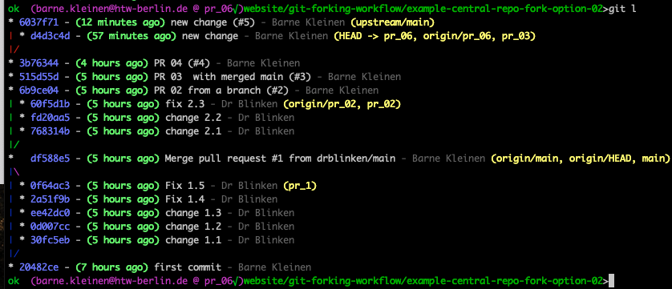
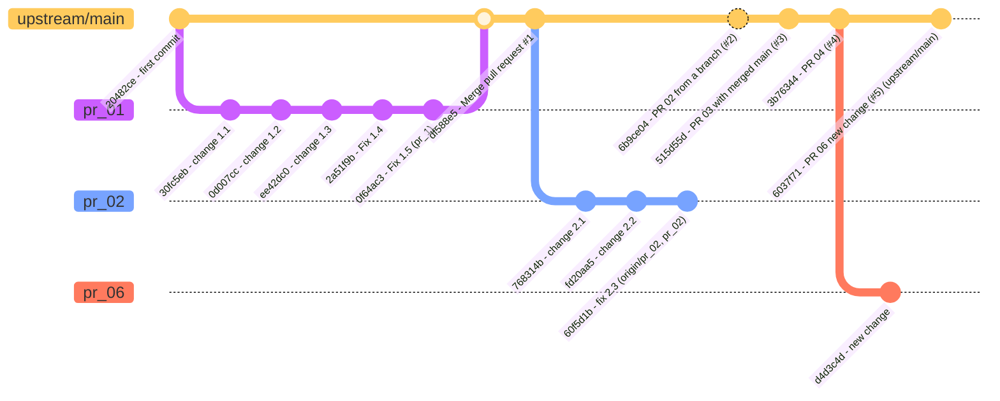

# Git Log
#bear/2024/07/07/created
#showtime/website/forking-workflow/git-log

To work effectively with git from the command line, you need to be able to see your branches and commits in an overview like this: 

here are the relevant lines from my ~/.gitconfig :
```
[alias]
    co = commit
    st = status
    ls = log --graph --oneline --all
    l = log --graph --abbrev-commit --decorate --date=relative --format=format:'%C(bold blue)%h%C(reset) - %C(bold green)(%ar)%C(reset) %C(white)%s%C(reset) %C(dim white)- %an%C(reset)%C(bold yellow  )%d%C(reset)' --all

```

Source: [Pretty Git branch graphs](https://stackoverflow.com/questions/1057564/pretty-git-branch-graphs), improved in [Visualizing branch topology in Git](https://stackoverflow.com/questions/1838873/visualizing-branch-topology-in-git/34467298#34467298)
And here’s the relevant documentation in case you ever want to change something:
[Git - pretty-formats Documentation](https://git-scm.com/docs/pretty-formats)


## Create Mermaid diagrams from git log

This is pretty close:
```
git log --graph --oneline --format=format:'commit id: "%h - %s %d"' --all
```

reverse:
```
git log --graph --oneline --format=format:'commit id: "%h - %s %d"' --all   | tac
```

show parent for creating own tree:
```
git log --graph --oneline --format=format:'commit id: "%h - %s %d (parent: %p)"' --all
```


