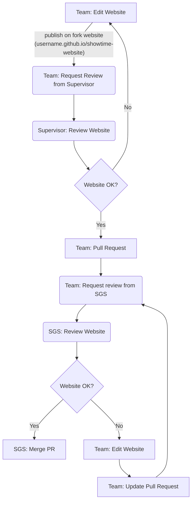

```mermaid

flowchart TD
    A[Team: Edit Website] -->|"publish on fork website\n(username.github.io/showtime-website)"| B(Team: Request Review from Supervisor)
    B --> R(Supervisor: Review Website)
    R --> C{Website OK?}
    C -->|Yes| D[Team: Pull Request]
    C -->|No| A
    D -->R1(Team: Request review from SGS)
    R1 --> R2(SGS: Review Website)
    R2 --> C1{Website OK?}
    C1 -->|Yes| M[SGS: Merge PR]
    C1 -->|No| A1[Team: Edit Website]
    A1 --> D1[Team: Update Pull Request]
    D1 --> R1

```
